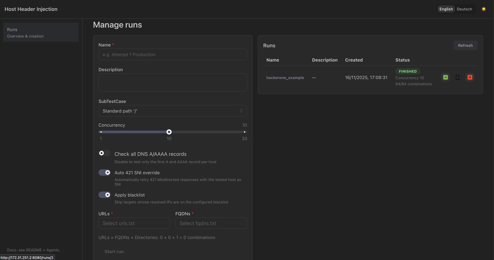
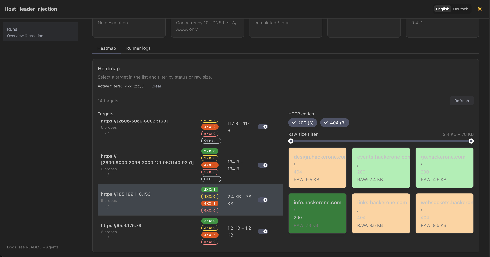
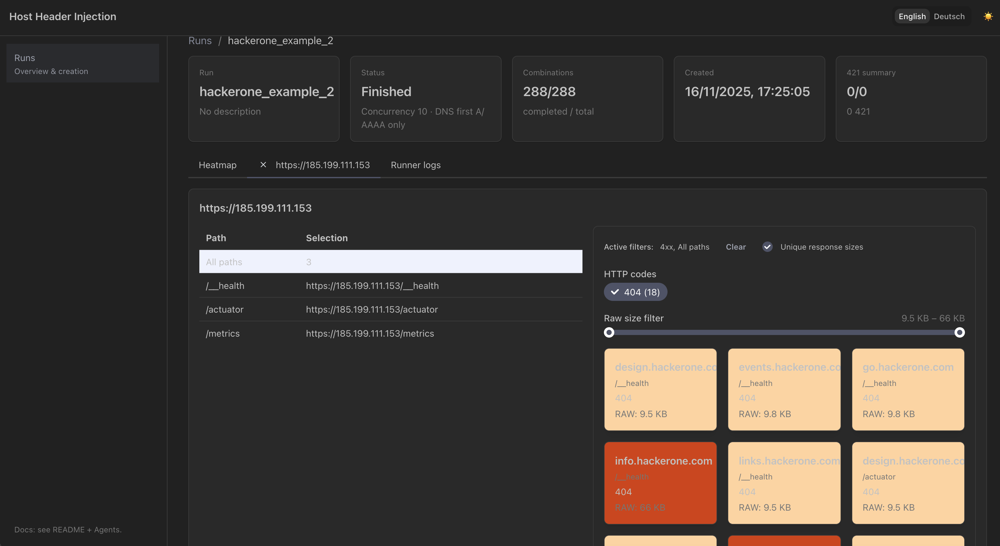

# Host-Header Injection / Directory Enumeration

The tool allows a list of FQDNs that are not publicly accessible from the Internet to be tested against a list of URLs by overriding the Host header.

This repository provides a complete pipeline for analyzing host-header tests and directory-enumeration tests:
- A FastAPI backend stores probes (HTTP responses per URL/FQDN), computes heatmap aggregates, and exposes REST endpoints.
- A Next.js frontend (Mantine UI) visualizes runs as heatmaps, tables, and probe details (including original URLs, SNI override badges, filters, logs).
- The runner executes the HTTP combinations server-side (including auto-421 SNI override, DNS options, blacklist handling) and persists raw responses as artifacts.

## Docker execution
Run the whole system without host-side Node setup via Docker:
```bash
docker compose up -d --build
```
- Backend API & health check: `http://localhost:8080/healthz` & Docs: http://localhost:8080/docs
- Frontend UI (served statically from the backend): `http://localhost:8080/ui`
- Artifacts are stored in the `artifacts_data` volume; the DB in `db_data`.

## Development with VibeCoding in Codex / Claude
This project was built entirely with VibeCoding in Codex. Changes, refactors, and new features can continue seamlessly in the same environment.

## Sequence Group — Single Connection

The **Sequence Group** TestCase implements the same pattern as Burp Suite Repeater's
*"Send group in sequence (single connection)"*. It is designed to test
**Client-Side Desync**, **HTTP Request Smuggling**, and **Host-Header Injection**
with minimal timing jitter.

### How it works

For every URL x FQDN pair the runner opens **one TCP connection** and sends
two requests back-to-back:

```
┌──────────┐        ┌──────────┐
│  Client   │───TCP──│  Server  │
└──────────┘        └──────────┘
     │                    │
     │─── GET /path ─────>│  Request 1 (Normal — original Host)
     │<── 200 OK ─────────│
     │                    │
     │─── GET /path ─────>│  Request 2 (Injected — FQDN as Host)
     │<── 200 OK ─────────│
     │                    │
     ╳  connection close  ╳
```

- **Request 1 (Normal):** `GET <URL>` with the URL's own hostname as Host header.
- **Request 2 (Injected):** `GET <URL>` with the FQDN as Host header.

Both requests travel over the **same TCP connection**, so the server sees them
as consecutive requests from the same client. This is critical for detecting
desync vulnerabilities where the server's internal state carries over between
requests.

### Usage

1. Select **Sequence Group** from the TestCase dropdown in the Run form.
2. Upload a URLs file and a FQDNs file (same as Standard mode).
3. Adjust timeout (up to 120s) and SSL verification if needed.
4. Click **Send sequence**.

The detail page shows results grouped by pair, with **Normal** and **Injected**
badges. Rows where the status code or response size differs between normal and
injected are highlighted. Click any row to open the Probe Drawer with the full
raw request/response dump.

### Technical details

- Backend runner uses `httpx` with `follow_redirects=False` for precise control.
- Each pair uses a fresh `httpx.Client` (single TCP connection, keep-alive).
- Raw exchanges are saved to `artifacts/sequence/run_{id}/` for forensic review.
- Runner logs are created in real time (visible in the Logs tab).
- Up to 5 000 URL x FQDN combinations per run.

## Further development via Agents/Tasks
Concrete working instructions for Codex are in `Agents.md` and `Tasks.md` (frontend/backend separately). Follow these to keep conventions, backlog priorities, and tests aligned.

## 🔍 DNS & subdomain checks with ProjectDiscovery

### 🧭 Find subdomains without A records

With **dnsx** you can quickly spot all FQDNs that have **no A record**. The command below uses `subfinder` to enumerate subdomains and then filters DNS entries without an IP:

```bash
subfinder -d hackerone.com | dnsx -a -json | jq -r 'select(.a | length == 0) | .host'
...
links.hackerone.com
websockets.hackerone.com
info.hackerone.com
go.hackerone.com
design.hackerone.com
events.hackerone.com
```

---

### 🌐 Generate reachable URLs (HTTP/HTTPS)

This pipeline creates a list of all FQDNs that:

1. exist,
2. have a valid A record,
3. and are reachable via HTTP/HTTPS.

```bash
subfinder -d hackerone.com | dnsx -a -json | jq -r 'select(.a | length != 0) | .host' | httpx
...
https://mta-sts.managed.hackerone.com
https://mta-sts.hackerone.com
https://mta-sts.forwarding.hackerone.com
http://b.ns.hackerone.com
http://a.ns.hackerone.com
https://gslink.hackerone.com
https://www.hackerone.com
https://support.hackerone.com
https://api.hackerone.com
https://docs.hackerone.com
```

---

### 🚫 Hosts with A record but not reachable via HTTPS

This command lists all subdomains that do have an IP but **cannot be reached successfully via HTTPS**:

```bash
subfinder -d heckerone.com | dnsx -a -json | jq -r 'select(.a | length != 0) | .host' | httpx -silent -probe | grep FAILED | cut -d " " -f 1
```

❗ Useful to uncover bad SSL configurations or blocked services.

---

### 🏠 Note on internal domains

The same methods work for **internal FQDNs**. Many companies use **Let’s Encrypt** or similar CAs even for internal systems. If the internal domain is known, those subdomains can also be checked with `dnsx` and `httpx` — handy for:

* internal bug bounty programs
* asset discovery
* vulnerability analysis in corporate networks

## Images

CreateRun:



Heatmap:


DirectoryEnummerationView:


## Disclaimer

This tool is for educational and authorized testing purposes only. Usage of this tool for attacking targets without prior mutual consent is illegal. The developers assume no liability and are not responsible for any misuse or damage caused by this program.
